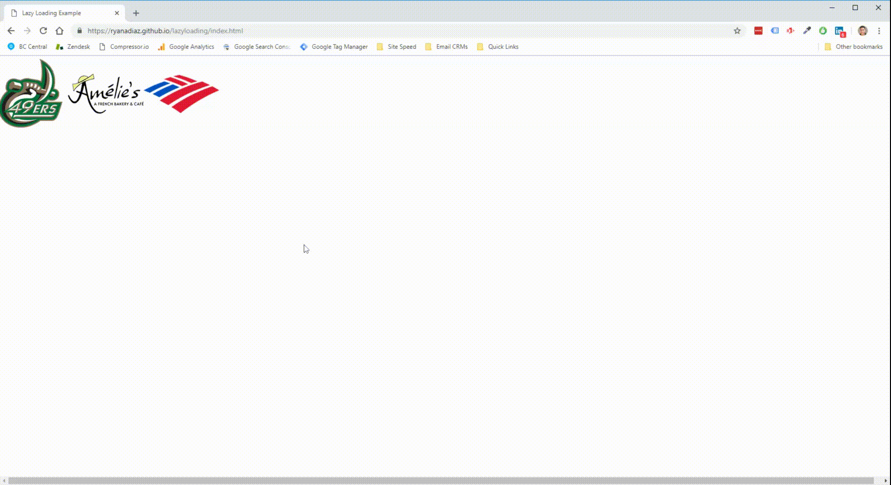

# lazyloading
## A case study in lazy loading images

Live Demo: [https://ryanadiaz.github.io/lazyloading/index.html](https://ryanadiaz.github.io/lazyloading/index.html)

**Summary**
* Utilizes the `vanilla-lazyload` script by [Andrea Verlicchi](https://www.andreaverlicchi.eu/lazyload/) to load images as they enter the viewport.

* It’s written in plain “vanilla” JavaScript, uses Intersection Observers, and supports responsive images.

**To run project**
* After cloning git repo, cd into the project root, then open **`index.html`** in your default browser
  

